# E-Commerce SvelteKit Project

This project is a simple e-commerce application built with SvelteKit. It utilizes the [Fake Store API](https://fakestoreapi.com/) for fetching product data. The user interface is designed using Tailwind CSS, with inspiration and components sourced from [Meraki UI](https://merakiui.com) and [Hyper UI](https://www.hyperui.dev).

## Features

- Product listing and filtering
- Shopping cart functionality
- User authentication for login
- Dark Mode for a more immersive experience

## Getting Started

To run the project locally, follow these steps:

1. Clone the repository
2. Install dependencies with `npm install`
3. Start the development server with `npm run dev`
4. Open your browser and navigate to [http://localhost:5173](http://localhost:5173)

Feel free to explore the various features of the application and provide feedback or contribute to its development!

## Built With

- [SvelteKit](https://kit.svelte.dev/)
- [Tailwind CSS](https://tailwindcss.com/)
- [Fake Store API](https://fakestoreapi.com/)
- [Meraki UI](https://merakiui.com)
- [Hyper UI](https://www.hyperui.dev)

## Screenshots

  
Homepage

  

    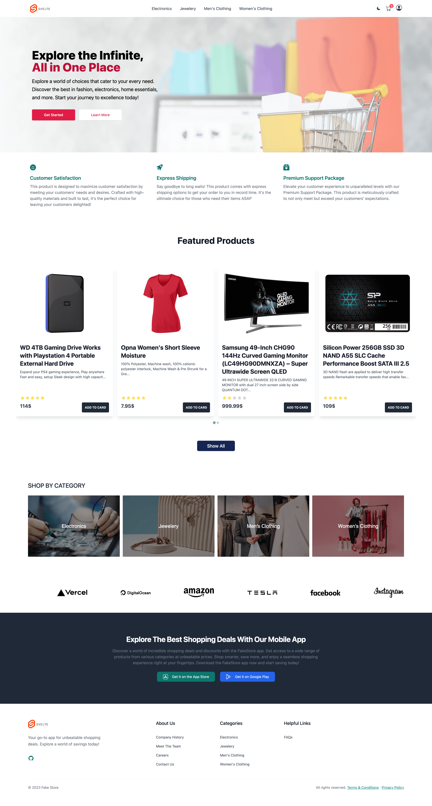
    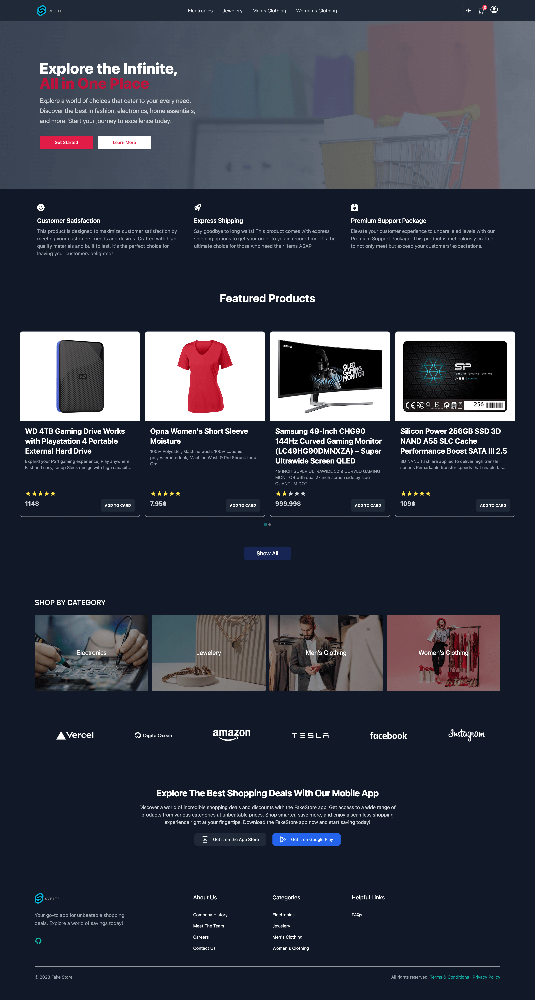
  

  
Products

  

    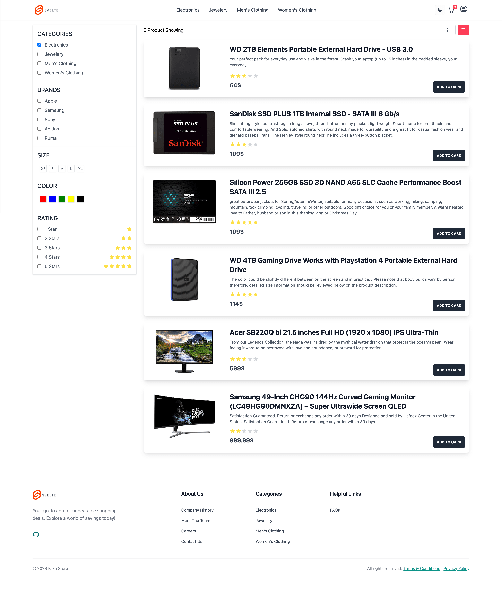
    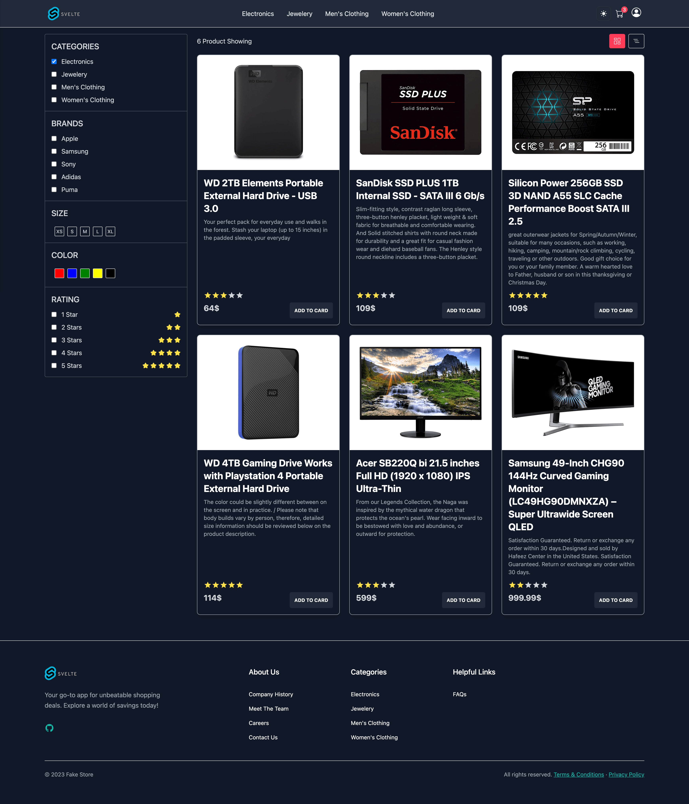
  

  
Product

  

    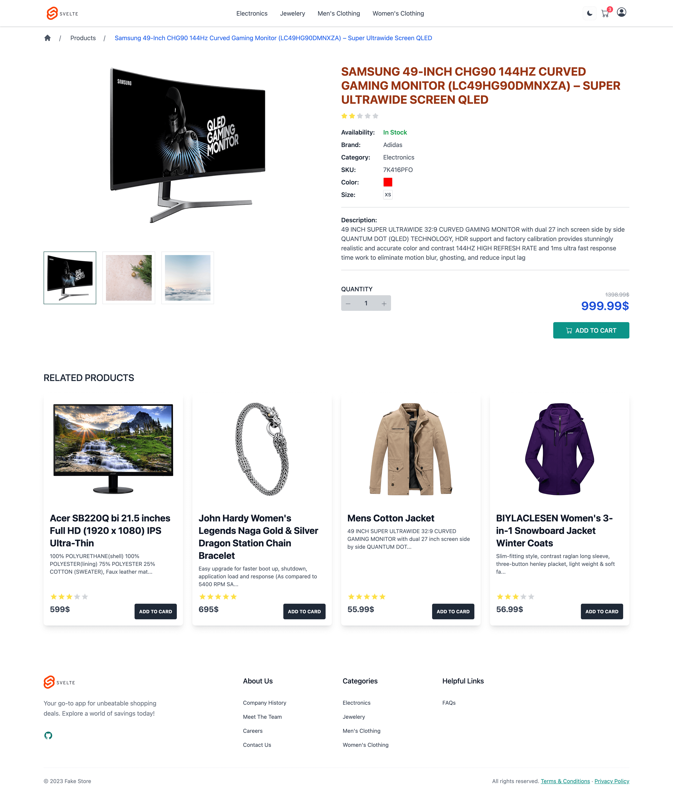
    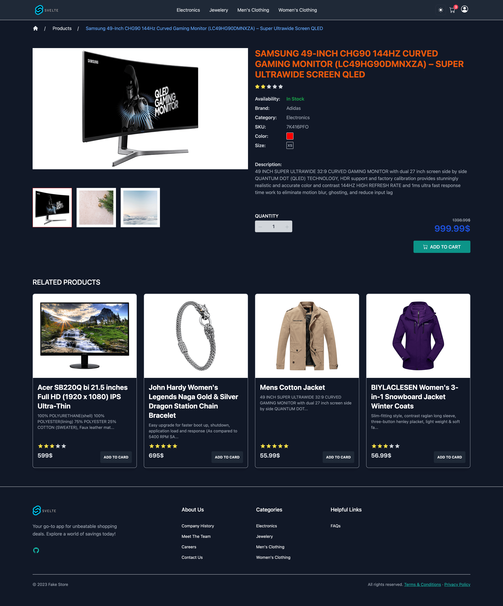
  

  
Cart

  

    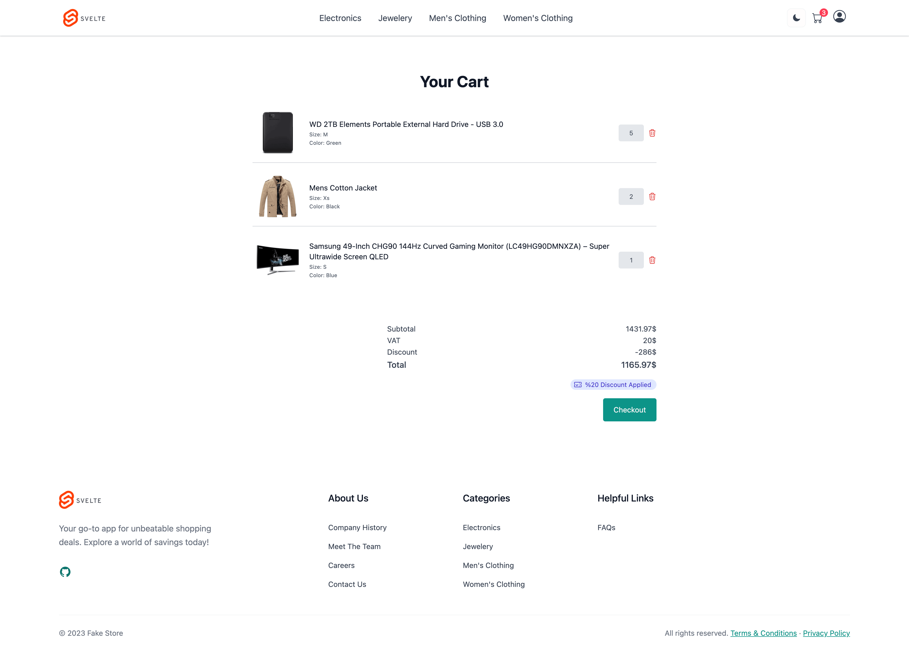
    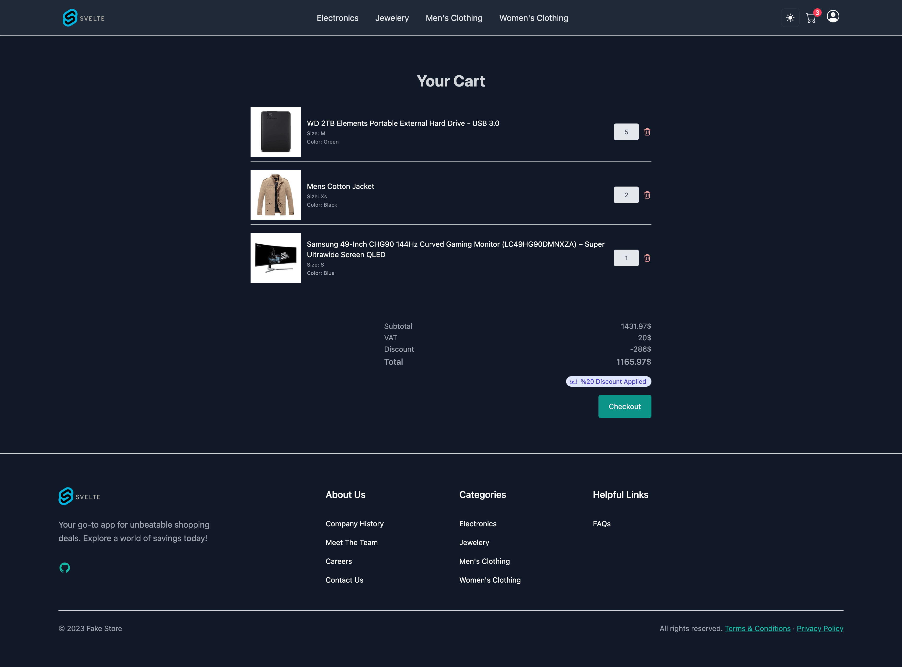
  

  
Login

  

    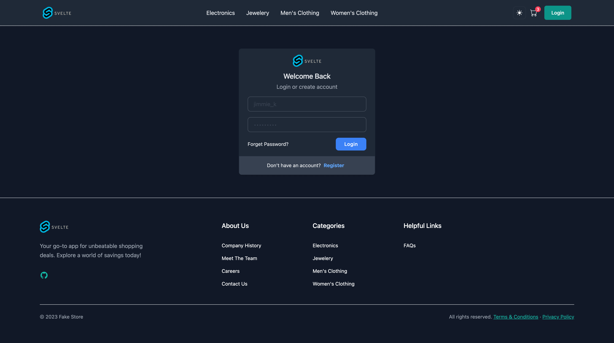
    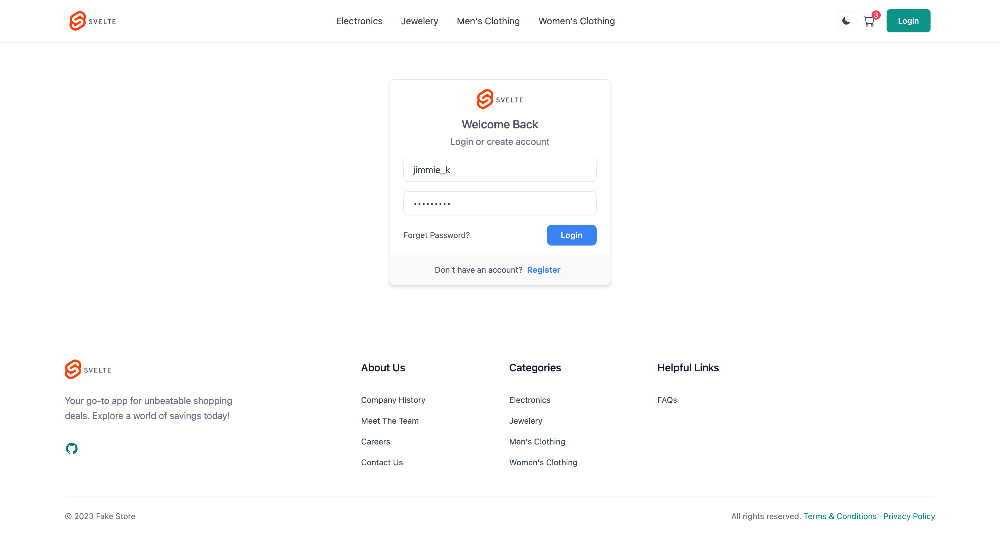
  

  
Contact Us

  

    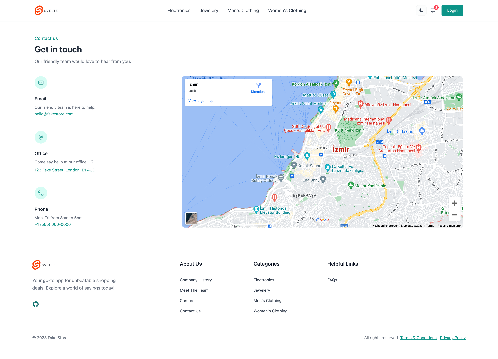
    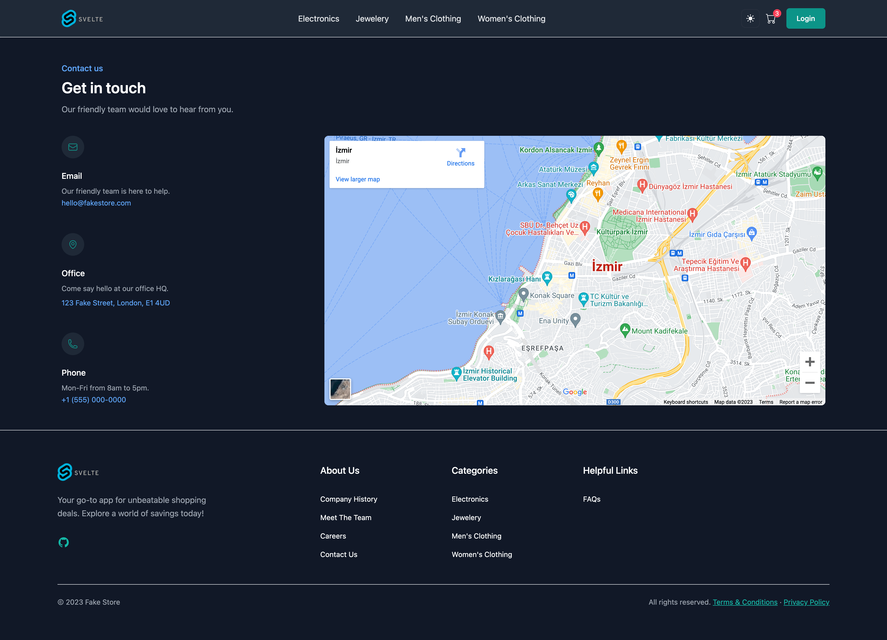
  

 ##### And Many More...

## License

This project is licensed under the MIT License - see the [LICENSE](LICENSE) file for details.

